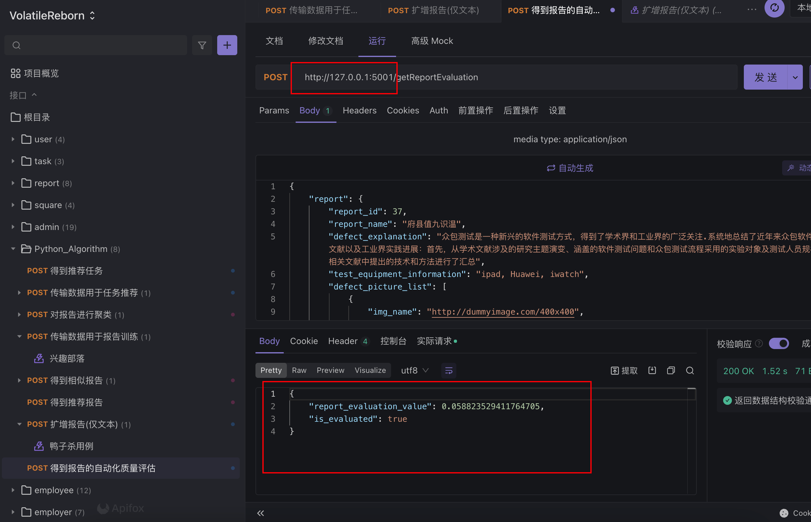

# Requirements


````
conda create -n volatile python=3.9

参照requirements.txt下载依赖

启动项目：
    python server.py


# 访问
 服务器url：（需要结合具体的请求方法,使用了lyk的服务器， 和前后端，Jenkins跑在一起， 可能会很卡）
    124.222.135.47:5001

````

# Dev

可以本地启动项目， 使用Apifox查看网络请求:



算法服务部署后, 可以使用Apifox在公网查看网络请求:

